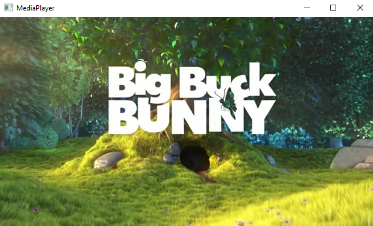

## Einfacher Media Player in C (mit SDL2 und FFMPEG Bibliotheken)

## Ziel von diesem Projekt
Dies ist ein persönliches Projekt
von mir, um ein Verständnis für die Arbeit mit verschiedenen Medien
zu entwickeln. Es basiert auf dem ["How to Write a Video Player in Less Than 1000 Lines"](http://www.dranger.com/ffmpeg/) Tutorial von Stephen Dranger. Da das Tutorial doch sehr veraltetet ist (Februar 2015) und in dem Tutorial SDL Version 1 verwendet wird und ich Version 2 verwende, gab es, durch den Unterschied in den Versionen von SDL und FFMPEG, verschiedene Hirden. Dadurch wurde ein reines Copy and Paste, glücklicher Weise, nicht möglich und hat mich veranlasst selber Lösungen zu finden.

## Todos
- [x] Lesen von Audio- und Videospuren
- [x] Dekodieren und Abspielen von Audio- und Videoframes
- [x] Einfache Kontrollfunktionen über die Tastatur (Pausieren, Programm schließen)
- [ ] Synchronisierung von Audio- und Videoframes
- [ ] Lesen und Anzeigen von Untertiteln
- [ ] Komplexere Kontrollfunktionen (Vor- und Zurückspulen, variable Geschwindigkeit, ...)
- [ ] Streamen von Audio und Video über verschiedene Protokolle (RTP, RTMP, ...)

Work in progress...